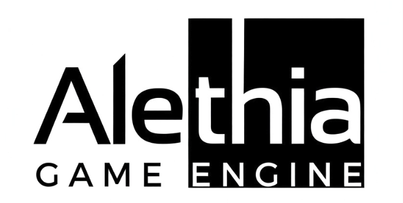
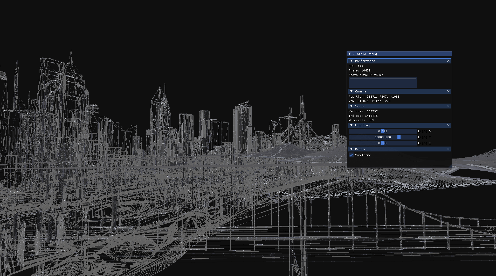
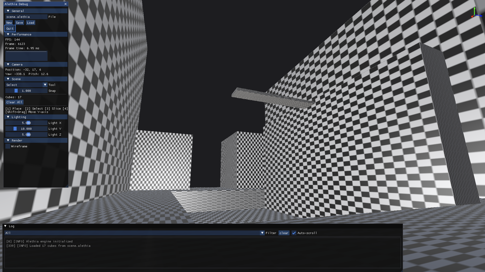
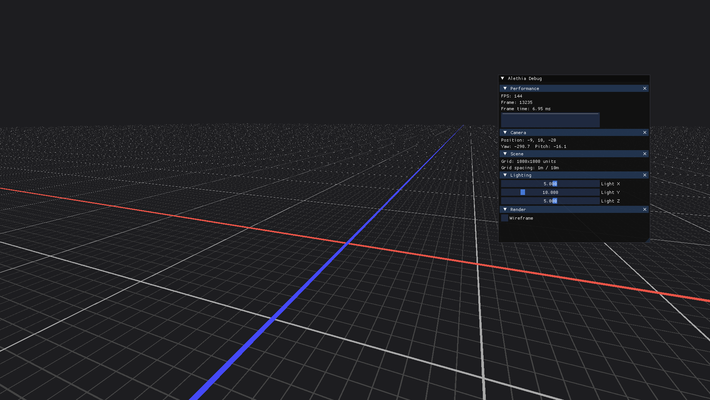
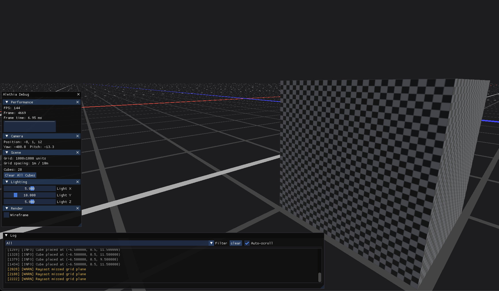

<p align="center">
  
</p>

<p align="center">
  <a href="https://marco-oj.no"></a>
  
  
  
  
  <br>
  
  
  
  
  <br>
  
  
  
  
  
  
  
  
  <br>
  
</p>

A custom Vulkan rendering engine and level editor built from scratch in C++20. Features Blinn-Phong lighting with hemisphere ambient, specular, and rim lighting, OBJ model loading with texture support, and a procedural grid renderer. The block placement system supports click-drag sizing, surface-aware stacking, face-drag resizing, axis-aligned slicing, multi-select, copy/paste with paste preview, and a 64-step undo/redo history. Scenes are saved and loaded in a custom binary format. Includes a modular debug UI with collapsible panels, a runtime logging system, line rendering infrastructure, configurable grid snapping, and an orientation gizmo. Per-object transforms via push constants, independent input management, and multiple rendering pipelines running in a single render pass. Features an edit/play mode switch with a first-person player controller, per-axis swept AABB collision against scene geometry, gravity, jumping, sprinting, and noclip flight mode.




## Requirements

- CMake 3.21+
- C++20 compiler
- Vulkan SDK (for headers/loader + `glslc` or `glslangValidator`)
- GLFW3
- GLM

> **macOS:** MoltenVK is required. This project enables Vulkan portability
extensions automatically. GLM is expected at `/opt/homebrew/include/glm/`
(install via `brew install glm`).

## Build & run
```sh
cmake -S . -B build -DCMAKE_BUILD_TYPE=Release
cmake --build build -j
./build/VulkanLab
```

## Controls

### Editor Mode
- **WASD** — fly camera
- **Mouse** — look
- **Space** — fly up
- **Shift** — fly down
- **Tab** — toggle editor UI / cursor
- **Escape** — quit

### Editor Tools (UI mode)
- **1** — Place tool
- **2** — Select tool
- **3** — Slice tool
- **4** — Move tool
- **Del / Backspace** — delete selected cube
- **Shift+Click** — multi-select
- **CMD+C** — copy selection
- **CMD+V** — paste
- **CMD+Z** — undo
- **CMD+Shift+Z** — redo
- **Shift+Drag** — move cube on Y axis

### Play Mode (P to enter, P to return to editor)
- **WASD** — walk
- **Shift** — sprint
- **Space** — jump
- **Mouse** — look
- **F** — toggle noclip / free flight
- **P** — return to editor



